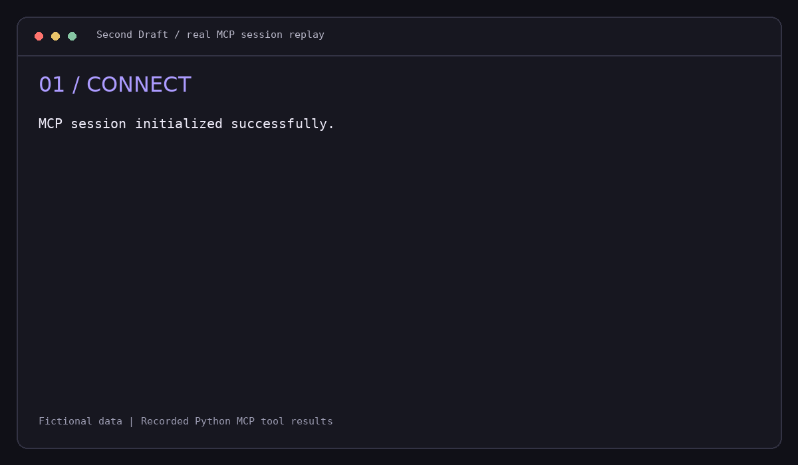
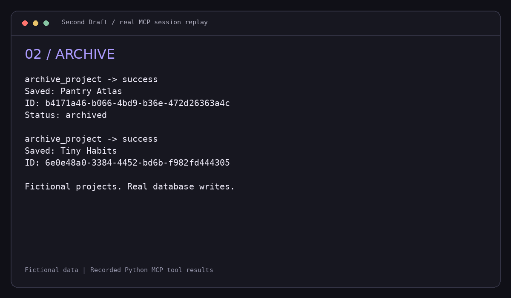
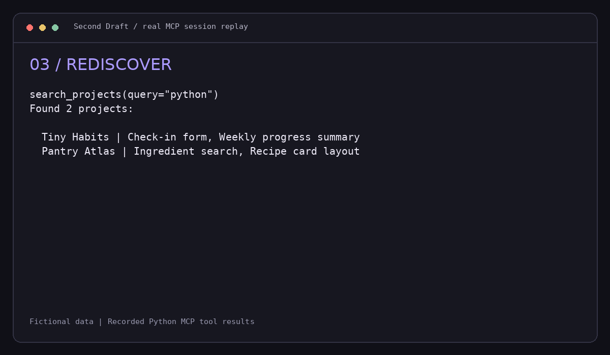
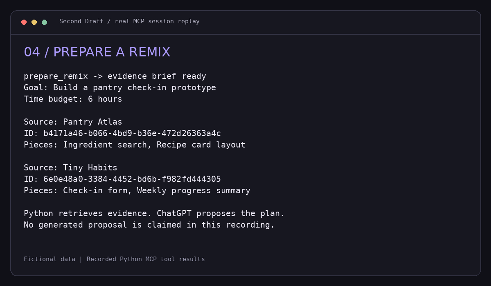
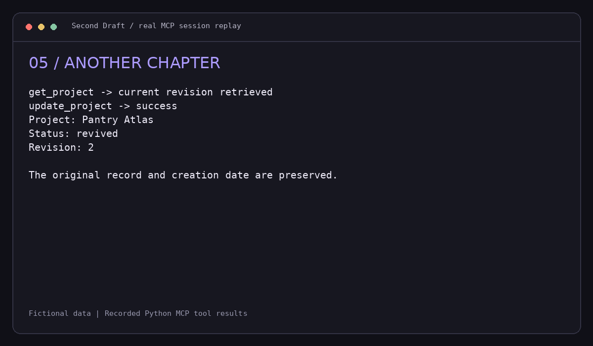

<div align="center">

# Second Draft

### Your unfinished projects deserve another chapter.

A personal archive that turns paused projects into material for your next idea.

[](https://github.com/LirielC/second-draft/actions/workflows/tests.yml)


[Quick start](#quick-start) · [See it work](#see-it-work) · [Tools](#tools) · [Connect to ChatGPT](#connect-to-chatgpt)

</div>

## Why Second Draft?

An unfinished project can still contain a useful component, a hard-earned lesson, or the beginning of something better. Second Draft keeps those pieces discoverable.

Archive what you tried, record why you stopped, and ask ChatGPT to find connections between past projects. When you want to start again, prepare a **Remix**: an evidence brief that helps the assistant propose a small new project using your existing work.

> **Archive → Rediscover → Remix → Revive**

## See it work



*Terminal replay rendered from actual Python MCP client/server calls. Project data is fictional. The recording demonstrates evidence retrieval; it does not simulate ChatGPT or claim to show an AI-generated plan.*

<details>
<summary><strong>View the recorded workflow images</strong></summary>

### Archive an unfinished project



### Rediscover reusable pieces



### Prepare a source-grounded Remix



### Give a project another chapter



</details>

The recording is reproducible:

```bash
python -m pip install -e '.[media]'
python scripts/record_demo.py
```

The script starts a real MCP server, makes tool calls through an MCP client, stores the results in `docs/media/transcript.json`, and renders the PNGs and GIF. It uses a temporary fictional database, so it never modifies your personal archive.

## What you can do

- **Archive** a project with its original idea, pause reason, lessons, tags, and reusable parts.
- **Rediscover** projects through literal keyword search.
- **Remix** 2–5 selected projects into a source brief with a goal and time budget.
- **Revive** a project while preserving its identity and creation date.
- **Keep control** with revision checks that prevent stale updates.

Two implementations are included:

| Implementation | Stack | Use it for |
| --- | --- | --- |
| Python MCP server | Python, official MCP SDK, SQLite | Local development and personal MCP clients |
| Hosted adapter and gallery | TypeScript, React/Vinext, Cloudflare D1 | A private ChatGPT-connected workspace |

The hosted adapter preserves the five-tool workflow while running on a Worker-compatible runtime. Local SQLite and hosted D1 are **separate archives**; automatic synchronization is not implemented.

## Quick start

Requires **Python 3.11+**.

```bash
git clone https://github.com/LirielC/second-draft.git
cd second-draft
python -m venv .venv
```

Activate the environment:

```bash
# macOS / Linux
source .venv/bin/activate

# Windows PowerShell
.venv\Scripts\Activate.ps1
```

Install and run:

```bash
python -m pip install -e '.[dev]'
python -m second_draft.demo --database data/demo.db
python -m second_draft.server --transport streamable-http --database data/demo.db
```

Your local endpoint is **`http://127.0.0.1:8000/mcp`**. The seed command creates three fictional projects and refuses to seed a nonempty database.

No OpenAI API key is required: these tools retrieve and persist records without making model API calls. ChatGPT generates suggestions from the returned evidence.

## Connect to ChatGPT

### Hosted personal workspace

The owner's private workspace is deployed at:

**[Open Second Draft](https://second-draft-liriel.lirielcastro26.chatgpt.site)**

It is private and is not a public portfolio demo. The associated personal plugin is provisioned; account installation and connection must be completed in ChatGPT before use. Open **Plugins → Personal → Created by you**, select **Second Draft**, and install/connect it if required.

The hosted tools use the authenticated Site user ID and scope every data query to that user. OAuth and the private access boundary are handled by the hosting platform.

### Your own deployment

For a standalone Python deployment:

1. Verify the tools locally using `npx @modelcontextprotocol/inspector@latest`.
2. Make the server reachable through Secure MCP Tunnel or an authenticated HTTPS deployment.
3. Enable **Settings → Security and login → Developer mode**, if available for your account/workspace.
4. Add the MCP connection in **ChatGPT Plugins**, using your tunnel or HTTPS endpoint ending in `/mcp`.
5. Enable it in a conversation and try an example prompt.

The standalone Python HTTP server has no built-in authentication and binds to localhost by default. Use Secure MCP Tunnel for personal development, or add MCP-compatible authentication before exposing real records publicly.

Official documentation: [Build an MCP server](https://developers.openai.com/plugins/build/mcp-server) · [Connect and test](https://developers.openai.com/plugins/deploy/connect-chatgpt)

### Local stdio clients

```json
{
  "mcpServers": {
    "second-draft": {
      "command": "/absolute/path/to/second-draft/.venv/bin/python",
      "args": [
        "-m", "second_draft.server",
        "--database", "/absolute/path/to/projects.db"
      ]
    }
  }
}
```

For Windows, use the absolute `.venv\\Scripts\\python.exe` path.

## Example conversations

**Archive**

> Archive my recipe app. I stopped because manual recipe entry became too much work. The ingredient search and recipe card layout are reusable. Tag it Python and food.

**Rediscover**

> Find projects that mention search. What reusable pieces did I record?

**Remix**

> Find two projects with reusable parts and prepare a remix for a pantry check-in prototype I could build in six hours. Cite the source project IDs, separate facts from assumptions, and suggest the smallest first step.

**Revive**

> Retrieve Pantry Atlas and mark it revived using its current revision.

These are example prompts, not a transcript of a completed ChatGPT conversation.

## Tools

| Tool | Purpose | Writes records? |
| --- | --- | --- |
| `archive_project` | Save user-provided project facts | Yes |
| `search_projects` | Search the archive; empty query lists recent projects | No |
| `get_project` | Retrieve a full record and its revision | No |
| `update_project` | Update allowed fields using `expected_revision` | Yes |
| `prepare_remix` | Retrieve evidence from 2–5 selected projects | No |

Project status: `archived`, `revived`, or `completed`. Updates cannot replace IDs or creation timestamps. No deletion tool is exposed.

**Remix returns evidence, not a generated project plan.** The assistant uses that evidence to propose a plan and cite the original projects. Repository links are references; Second Draft does not inspect their code.

## Project structure

```text
second-draft/
├── src/second_draft/     Python archive and MCP tools
├── tests/               Persistence, validation, and protocol tests
├── scripts/             Reproducible MCP media recording
├── docs/media/          English workflow GIF, PNGs, and transcript
├── examples/            Manual evaluation prompts
├── cloud/               Hosted TypeScript adapter and gallery
└── .github/workflows/   Python CI
```

## Testing

```bash
python -m pytest -q
```

The Python suite checks persistence, literal search, input validation, missing IDs, revision conflicts, Remix source integrity, HTTP route configuration, and a real MCP client/server exchange over stdio. CI runs on Python 3.11, 3.12, and 3.13.

Hosted development and type checks are documented in [cloud/README.md](cloud/README.md).

## Data and boundaries

- Default local archive: `~/.second-draft/projects.db`. Override with `--database` or `SECOND_DRAFT_DB`.
- SQLite files are not encrypted. Personal databases and secrets are excluded from Git.
- Hosted records are durable in D1 and are scoped to authenticated users.
- Records sent to ChatGPT become part of your interaction with that service.
- Search is literal keyword matching, not semantic search.
- The web gallery prepares a source brief; it does not generate AI proposals itself.
- No automatic GitHub repository analysis, scheduling, or local/cloud synchronization is included.

## Next chapters

- Semantic discovery across larger project archives.
- Explicitly authorized repository analysis with file-level evidence.
- Import/export between local and hosted archives.
- An embedded MCP Apps gallery inside ChatGPT.

---

Built by [LirielC](https://github.com/LirielC).
